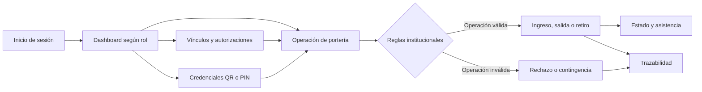

# VALIDGATE

Sistema web para gestionar y registrar el ingreso, la salida y el retiro de estudiantes en instituciones educativas.

VALIDGATE centraliza la identificación de estudiantes y responsables, aplica reglas institucionales antes de registrar un movimiento y conserva trazabilidad de las operaciones aprobadas, rechazadas o realizadas mediante contingencia.

> Estado: producto mínimo viable (MVP) en desarrollo.

## Objetivo

El sistema busca reducir procesos manuales como el reconocimiento visual, las confirmaciones verbales y los registros dispersos. Para ello, entrega una vista y permisos diferentes a cada participante del proceso escolar:

- administración institucional;
- personal de portería;
- docentes;
- Apoderados Primarios;
- Apoderados Secundarios;
- estudiantes.

## Flujo funcional general



En términos operativos:

1. El usuario inicia sesión y accede a un dashboard adaptado a su rol.
2. Los Apoderados Primarios, Apoderados Secundarios y estudiantes consultan únicamente los estudiantes y vínculos que les corresponden.
3. El estudiante o su Apoderado Primario puede generar una credencial QR temporal.
4. Portería identifica al estudiante, selecciona el evento y aplica el método de validación permitido.
5. El sistema comprueba el estado actual del estudiante, sus permisos y la política de la institución.
6. Una operación aprobada actualiza el estado del estudiante; una rechazada conserva la evidencia sin cambiarlo.
7. El evento queda disponible en la trazabilidad según el alcance de cada rol.

## Roles y capacidades

| Rol | Capacidades principales |
|---|---|
| **Administrador** | Supervisa la institución, opera el módulo de portería, administra vínculos apoderado-estudiante y configura políticas de acceso y retiro. |
| **Portería** | Busca estudiantes, valida credenciales y registra ingresos, salidas y retiros. También procesa la cola de retiros con validación dual. |
| **Docente** | Consulta estudiantes, cursos, asistencia y eventos visibles de su institución. |
| **Apoderado Primario** | Vincula estudiantes mediante código, consulta su información, genera QR, responde solicitudes de salida y administra Apoderados Secundarios temporales. |
| **Apoderado Secundario** | Ve solamente estudiantes con una autorización temporal vigente e inicia solicitudes de retiro durante ese período. |
| **Estudiante** | Consulta su estado, responsables, horario y asistencia; genera su QR, responde solicitudes de retiro y solicita salida autónoma cuando está habilitado. |

Los permisos se validan tanto en la interfaz como en el servidor y en las políticas de acceso a datos de Supabase.

## Flujos implementados

### 1. Autenticación y perfil

- Registro con nombre, correo y contraseña.
- Inicio y cierre de sesión mediante Supabase Auth.
- Opción para recordar la sesión.
- Protección de rutas internas para usuarios autenticados.
- Navegación y acciones adaptadas al rol.
- Edición de nombre, RUT y teléfono.
- Cambio de contraseña validando primero la contraseña actual.
- Las cuentas creadas desde el registro público reciben el rol técnico `APODERADO`, presentado como Apoderado Primario.

### 2. Vinculación entre apoderados y estudiantes

Existen dos mecanismos:

- **Vinculación por código:** el Apoderado Primario ingresa el código entregado por la institución. El sistema valida el código, evita duplicados y crea una relación permanente.
- **Vinculación administrativa:** un administrador relaciona una cuenta de Apoderado Primario existente con un estudiante de su institución y puede retirar esa relación.

Una vez creado el vínculo, el Apoderado Primario puede consultar el estado, detalle, eventos, credenciales y solicitudes disponibles para ese estudiante. También puede desvincularse cuando las reglas lo permiten.

### 3. Apoderados Secundarios autorizados temporalmente

Un administrador o Apoderado Primario puede autorizar a un Apoderado Secundario para retirar a un estudiante:

1. Selecciona al estudiante.
2. Registra nombre, correo y período de vigencia.
3. Si la cuenta ya existe, VALIDGATE reutiliza su identidad; de lo contrario, envía una invitación por correo.
4. La relación queda activa solamente entre las fechas indicadas.
5. El Apoderado Secundario ve al estudiante únicamente mientras la autorización está vigente.
6. El administrador o el Apoderado Primario que creó la autorización puede revocarla anticipadamente.

Las relaciones vencidas o revocadas permanecen como historial, pero no permiten iniciar nuevos retiros.

### 4. Credencial QR temporal

El estudiante o su Apoderado Primario puede generar un QR opaco para presentarlo en portería. La credencial:

- no contiene datos personales legibles;
- vence después de dos minutos;
- queda asociada al estudiante, la institución y la cuenta que la generó;
- no puede volver a utilizarse después de ser consumida;
- se rechaza si está vencida, revocada, usada o no corresponde al evento solicitado.

Portería puede escanear el código con la cámara o ingresar su contenido para validarlo antes de confirmar un ingreso o una salida.

### 5. Registro de ingreso y salida

Portería puede localizar estudiantes mediante búsqueda, selección por curso o QR. Antes de guardar un evento, el sistema considera:

- tipo de evento: ingreso o salida;
- tipo de salida: regular, retiro autorizado o salida autónoma;
- método de validación: manual, QR o PIN;
- estado actual dentro o fuera de la institución;
- permiso para salir sin acompañante;
- autorización de salida vigente;
- política de autenticación definida por la institución;
- observaciones y motivos de contingencia.

Las validaciones evitan, entre otros casos, registrar un ingreso duplicado, una salida sin ingreso activo o una salida autónoma no permitida.

Cuando una operación aprobada se registra:

- el estudiante cambia a estado **dentro** o **fuera** de la institución;
- se actualizan los bloques de asistencia relacionados cuando corresponde;
- se conserva quién registró el evento, cuándo ocurrió, cómo fue validado y cuál fue su resultado.

Una operación rechazada queda registrada para trazabilidad, pero no altera el estado del estudiante.

### 6. Contingencia sin dispositivo

Si no es posible utilizar QR o PIN, portería puede registrar una validación manual controlada cuando la política institucional lo permita. Debe seleccionar un motivo y agregar una observación.

Entre los motivos contemplados están la ausencia de dispositivo, falta de batería, QR o cámara no disponible y otras situaciones justificadas.

### 7. Solicitud de salida autónoma

El estudiante puede solicitar permiso para salir por sus propios medios:

1. Debe estar vinculado a un perfil estudiantil y encontrarse dentro de la institución.
2. Envía una solicitud con un motivo opcional.
3. La solicitud permanece disponible durante 15 minutos.
4. El Apoderado Primario la aprueba o rechaza desde su dashboard.
5. Una aprobación genera un retiro pendiente y dos PIN independientes para el Apoderado Primario y el estudiante.
6. Portería valida presencialmente ambos PIN; la segunda validación completa el retiro sin una aprobación adicional.
7. El sistema muestra una instrucción nominal, registra la salida y cambia al estudiante al estado fuera de la institución.

El estudiante inicia la solicitud, el Apoderado Primario la aprueba y portería valida ambas identidades; no existe un segundo clic de aprobación.

### 8. Retiro con validación dual

El retiro por Apoderado Primario o Apoderado Secundario requiere validar por separado al apoderado responsable y al estudiante:

1. El Apoderado Primario o Secundario inicia la solicitud desde el dashboard.
2. El estudiante recibe la solicitud y puede aceptarla o rechazarla.
3. Solo después de la aceptación se generan dos PIN independientes: uno para el responsable y otro para el estudiante.
4. Cada persona presenta su PIN exclusivamente en portería.
5. Portería valida ambos PIN o utiliza una validación manual controlada con motivo y observación.
6. La segunda validación completa automáticamente la salida efectiva y muestra a portería los nombres que debe comprobar.
7. El sistema registra el retiro y cambia al estudiante a estado fuera de la institución.

El proceso contempla:

- vencimiento configurable de los PIN;
- límite configurable de intentos por persona;
- bloqueo por intentos fallidos;
- cancelación por quien inició el retiro;
- rechazo por el estudiante;
- rechazo en portería con motivo;
- invalidación de PIN usados, vencidos o cancelados;
- historial de cada transición y validación.

La cola de retiros de portería se actualiza automáticamente para mostrar solicitudes activas y finalizadas recientemente.

### 9. Horarios y asistencia

El detalle del estudiante presenta:

- estado dentro o fuera de la institución;
- permiso de salida autónoma;
- responsables vinculados;
- horario diario;
- estado de asistencia por bloque: presente, ausente, tardanza o salida.

Los roles institucionales autorizados pueden actualizar la asistencia. Los demás usuarios acceden solo a la información permitida por sus vínculos y rol.

### 10. Trazabilidad

Los dashboards muestran eventos recientes según el ámbito de cada usuario. Los registros pueden incluir:

- estudiante e institución;
- tipo y subtipo de evento;
- fecha y hora;
- persona involucrada y usuario que lo registró;
- método de validación;
- resultado aprobado o rechazado;
- observaciones, contingencias o causas de rechazo;
- referencia a solicitudes y autorizaciones relacionadas.

## Configuración institucional

El administrador puede definir por institución:

- si ingreso y salida requieren QR o PIN;
- si el autenticador es excluyente o se admite registro manual;
- si una salida manual exige observación;
- vigencia de los PIN de retiro, entre 1 y 60 minutos;
- máximo de intentos por PIN, entre 1 y 10;
- mensaje que recibe el estudiante ante una solicitud de retiro.

Estas reglas se vuelven a validar en el servidor y la base de datos; no dependen solamente de los controles de la interfaz.

## Seguridad y aislamiento de datos

- Supabase Auth administra las identidades y sesiones.
- Las rutas privadas requieren una sesión válida.
- El rol y la institución de una cuenta no pueden ser modificados por el propio usuario.
- Row Level Security limita los datos por institución, rol y relación vigente.
- Los Apoderados Secundarios solo acceden a estudiantes autorizados durante el período configurado.
- Las operaciones críticas de autorización, QR y retiro se ejecutan mediante funciones transaccionales en PostgreSQL.
- La `SUPABASE_SERVICE_ROLE_KEY` se utiliza únicamente en el servidor para enviar invitaciones; nunca debe exponerse como variable pública.
- Las claves, PIN, payloads QR y credenciales E2E locales no deben versionarse.

## Stack tecnológico

- Next.js con App Router y Server Actions.
- React y TypeScript en modo estricto.
- Supabase Auth, PostgreSQL, Row Level Security y Realtime.
- Tailwind CSS.
- Playwright para pruebas funcionales end-to-end.
- npm para dependencias y scripts.
- Ejecución local de una build de producción para la validación académica.
- Vercel u otra plataforma compatible como alternativa productiva futura.

## Estructura del software

```text
src/app/                 Rutas, páginas y Server Actions
src/components/          Componentes de interfaz y formularios
src/lib/                 Autenticación, permisos, validaciones y clientes Supabase
supabase/migrations/     Esquema, funciones, políticas RLS y datos base
e2e/                     Escenarios y utilidades de Playwright
assets/                  Recursos visuales de la aplicación
```

Los documentos y scripts usados localmente para elaborar la tesis no forman parte del funcionamiento de VALIDGATE.

## Puesta en marcha local

### Requisitos

- Node.js compatible con Next.js 16.
- npm.
- Un proyecto Supabase con las migraciones del repositorio aplicadas en orden.

### Variables de entorno

Copia `.env.example` como `.env.local` y configura:

```env
NEXT_PUBLIC_SUPABASE_URL=https://tu-proyecto.supabase.co
NEXT_PUBLIC_SUPABASE_PUBLISHABLE_KEY=tu-clave-publica
NEXT_PUBLIC_SITE_URL=http://localhost:3000
SUPABASE_SERVICE_ROLE_KEY=tu-clave-de-servicio
```

`SUPABASE_SERVICE_ROLE_KEY` solo es necesaria para invitar Apoderados Secundarios y debe permanecer exclusivamente en el servidor.

### Instalación y ejecución

```powershell
npm install
npm run dev
```

La aplicación queda disponible normalmente en `http://localhost:3000`.

Para comprobar el build de producción:

```powershell
npm run build
npm run start
```

### Preparación de la demo académica

La defensa utiliza una build de producción ejecutada en el PC de demostración y
Supabase Cloud para autenticación y persistencia:

```bash
npm run demo
```

El comando valida el entorno y la configuración, comprueba Supabase sin escribir
datos, construye la aplicación, inicia Next.js y ejecuta un smoke Playwright de
solo lectura funcional. Al finalizar las comprobaciones, el servidor permanece
activo hasta presionar `Ctrl+C`.

Desde PowerShell, abre Git Bash antes de ejecutar el comando. En esta máquina,
Git Bash está instalado en `C:\Program Files\Git\bin\bash.exe`; el comando
`bash` de PowerShell puede corresponder a WSL.

Consulta [la guía de demo local](docs/DEMO_LOCAL.md) para opciones y contingencias.

## Pruebas E2E

La suite Playwright cubre 47 casos funcionales con IDs únicos: autenticación, restricciones, vinculación, ingreso, salida regular, contingencia, retiro con PIN dual y aislamiento de trazabilidad por familia, institución, vigencia y rol docente.

Configura `.env.e2e.local` a partir de `.env.e2e.example` y utiliza exclusivamente un proyecto Supabase de testing.

```powershell
npm run test:e2e:list
npm run test:e2e
npm run test:e2e:headed
npm run test:e2e:ui
npm run test:e2e:report
```

Las ejecuciones generan reportes HTML, JSON, JUnit y PDF, además de capturas, videos y trazas cuando corresponde. Cada corrida se conserva en una carpeta independiente `reports/YYYYMMDD-HHMM/` y no se versiona.

Consulta [la guía de pruebas E2E](reports/README.md) para la configuración segura del ambiente de pruebas.

## Alcance actual del MVP

Actualmente están implementados:

- autenticación, sesión y perfil;
- acceso diferenciado para seis roles;
- aislamiento de datos por institución y relación;
- vinculación de apoderados por código y por administración;
- autorizaciones temporales para Apoderados Secundarios;
- QR temporal de uso único;
- registro manual, por QR y por PIN;
- reglas configurables de ingreso y salida;
- contingencia manual documentada;
- solicitudes de salida autónoma;
- retiro con validación dual;
- horarios, asistencia y estado del estudiante;
- trazabilidad de eventos;
- pruebas E2E con generación de evidencias.

Quedan fuera del alcance actual las integraciones con dispositivos físicos, notificaciones push o SMS, analítica institucional avanzada y mecanismos biométricos.

## Documentación relacionada

- [Preparación de la demo local](docs/DEMO_LOCAL.md)
- [Configuración local](docs/CONFIGURACION_LOCAL.md)
- [Descripción del sistema actual](docs/validgate_sistema_actual.md)
- [Pruebas end-to-end](reports/README.md)
- [Plan de pruebas funcionales](reports/plan_pruebas_funcionales_validgate.md)
- [Flujo de Apoderados Secundarios](docs/AUTHORIZED_RETRIEVER_FLOW.md)

## Autor

**Matías Ignacio Reyes Bettancourt**  
Ingeniería en Computación e Informática  
Universidad Andrés Bello  
Santiago, Chile — 2026
